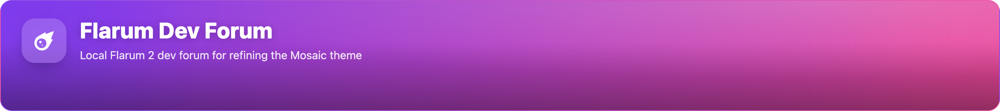
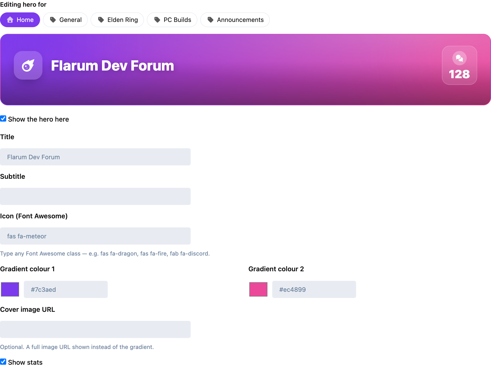

# Hero Builder for Flarum

**A fully customizable, animated hero banner for your Flarum 2 discussion list — designed live, per page and per tag.**

[](LICENSE)
[](https://flarum.org)

Give your community a polished, modern welcome. Hero Builder adds a configurable banner to the top of your discussion list — a title, subtitle, any Font Awesome icon, an animated gradient or a cover image, and optional live community stats. Set a different hero for the home page **and for every tag**, all from a live in-admin editor. No core files are touched.



---

## Features

- **Title & subtitle** — say hello, set the tone.
- **Any Font Awesome icon** — type the class (`fas fa-meteor`, `fas fa-dragon`, `fab fa-discord` …), not a fixed preset list.
- **Animated two-colour gradient** *or* a **cover image** — pick a palette or drop in a full-bleed background.
- **Optional live stats** — surface real community numbers in the banner.
- **Per-context heroes** — a distinct hero for the **home page** and for **each tag**, so every corner of your forum gets its own welcome.
- **No core files touched** — ships as a clean, self-contained extension.

---

## Hero Studio — design it live

Everything is configured in **Admin → Extensions → Hero Builder**, in the **Hero Studio**: pick a context (the home page or any tag), edit the fields, and watch the banner update in a live preview as you type. No saving-and-refreshing to see how it looks.



Tabs across the top let you switch between the home hero and a per-tag hero; the **"Show the hero here"** toggle lets you enable it only where you want it.

---

## Installation

```bash
composer require ernestdefoe/hero-builder
php flarum cache:clear
```

Then open **Admin → Extensions → Hero Builder** and start designing.

### Requirements

- Flarum **2.0+**
- PHP 8.1+

---

## Building from source

```bash
cd js
npm install
npm run build
```

---

## License

[MIT](LICENSE) © Ernest Defoe. Free to use, fork and build on.
